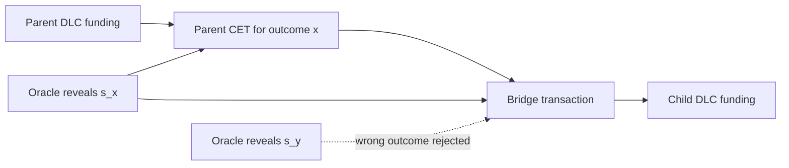

# NITI

[](https://github.com/dev865077/NITI/actions/workflows/v0-1-validation.yml)


NITI is a research and implementation workspace for composable Discreet Log
Contracts, or cDLCs.

The core result is narrow: a DLC oracle attestation scalar revealed by a parent
contract can also complete adaptor signatures on a bridge transaction that
funds the next contract.

The project is not production software. Do not use it with mainnet funds.

## Current State

NITI now has public signet evidence for a single cDLC activation path:

```text
public signet funding
  -> parent CET confirmed
  -> oracle scalar completes bridge adaptor signature
  -> bridge confirmed
  -> child funding output exists
```

The funded public signet run was merged in
[`docs/evidence/public-signet/`](docs/evidence/public-signet/).

| Item | Value |
| --- | --- |
| Funding output | [`65d17c3c...b9db2490:0`](https://mempool.space/signet/tx/65d17c3ccddb83733030995a7b1c59796beb4e4012b5706caa4ab6abb9db2490), `10,000 sats` |
| Parent CET | [`b6d80069...93b9838c`](https://mempool.space/signet/tx/b6d800695fa61219bdf7de10a4b97e0efae0bf974283293284aa40e893b9838c), signet block `302040` |
| Bridge | [`6b0c1951...0f8042cc`](https://mempool.space/signet/tx/6b0c1951480aa62914ed38ca3629666d4d37033b2dabf9f424ffb7450f8042cc), signet block `302041` |
| Child funding output | `6b0c1951480aa62914ed38ca3629666d4d37033b2dabf9f424ffb7450f8042cc:0`, `8,500 sats` |
| Evidence bundle | [`public-activation-evidence-bundle.json`](docs/evidence/public-signet/public-activation-evidence-bundle.json) |
| Verifier log | [`public-verifier.log`](docs/evidence/public-signet/public-verifier.log) |

The Layer 2 public signet EPIC is closed. The remaining major work is not
another proof of the basic activation primitive; it is protocol hardening:
bilateral negotiation, oracle auditability, economic stress, wallet UX,
fee/reorg policy, and external review.

## Contents

- [Current State](#current-state)
- [Precise Claim](#precise-claim)
- [How cDLC Composition Works](#how-cdlc-composition-works)
- [Evidence Map](#evidence-map)
- [Quick Start](#quick-start)
- [Reproduce The v0.1 Evidence](#reproduce-the-v01-evidence)
- [Repository Map](#repository-map)
- [Formal Models](#formal-models)
- [Bitcoin Harnesses](#bitcoin-harnesses)
- [Financial Product Models](#financial-product-models)
- [For AI Agents](#for-ai-agents)
- [Security Boundary](#security-boundary)
- [Roadmap](#roadmap)
- [License](#license)

## Precise Claim

The conservative claim supported by the current repository is:

> Under the documented cryptographic and operational assumptions, NITI
> demonstrates a composable cDLC activation path in which a parent DLC oracle
> scalar completes the selected parent settlement and also completes a bridge
> transaction into child funding, while a non-corresponding oracle scalar fails
> to activate that bridge.

This claim is supported at three execution layers:

| Layer | Status |
| --- | --- |
| Formal algebra | SPARK/Ada models prove the core adaptor/oracle equations in finite models with no `pragma Assume` in the proof sources. |
| Deterministic/regtest evidence | Local deterministic transcripts and Bitcoin Core regtest broadcast/confirmation evidence are committed. |
| Public signet evidence | A funded parent output, parent CET, bridge, and child funding output were broadcast and confirmed on public signet. |

NITI does not claim:

- mainnet readiness;
- production custody safety;
- production wallet UX;
- a complete bilateral DLC protocol;
- a complete auditable oracle service;
- production Lightning channel support;
- guaranteed liquidity, solvency, or redemption;
- legal or regulatory readiness.

## How cDLC Composition Works

A Schnorr oracle commits to a nonce point `R_o` and later attests an outcome
`x` by revealing:

```text
e_x = H(R_o || V || x)
s_x = r_o + e_x v mod n
S_x = s_xG = R_o + e_xV
```

Before the event, `S_x` is public but `s_x` is unknown. A cDLC uses `S_x` as
the adaptor point for a bridge transaction. When the oracle publishes `s_x`,
the bridge signature is completed:

```text
s = s_hat + s_x mod n
```

That bridge spends a parent outcome output and creates the funding output for a
child DLC. Bitcoin validates ordinary Taproot/Schnorr spends; the contract
graph and financial semantics remain off-chain.



## Evidence Map

Use this table as the top-level audit map.

| Evidence | Where | What it supports |
| --- | --- | --- |
| Primary whitepaper | [`WHITEPAPER.md`](WHITEPAPER.md) | cDLC construction, security claims, Lightning extension, and limitations. |
| Protocol summary | [`docs/PROTOCOL.md`](docs/PROTOCOL.md) | Compact protocol description: oracle, adaptor, bridge, Lightning, graph discipline. |
| Architecture note | [`docs/ARCHITECTURE.md`](docs/ARCHITECTURE.md) | Research, proof, and testnet architecture. |
| Public signet activation bundle | [`docs/evidence/public-signet/`](docs/evidence/public-signet/) | Funded public signet parent CET, bridge confirmation, child funding output, raw tx files, verifier log. |
| Regtest Bitcoin Core bundle | [`docs/evidence/issue-132-regtest/`](docs/evidence/issue-132-regtest/) | Controlled Bitcoin Core regtest RPC broadcast, mempool checks, confirmations, raw tx files, timeout path. |
| Deterministic Layer 2 closeout | [`docs/L2_EPIC_CLOSEOUT.md`](docs/L2_EPIC_CLOSEOUT.md) | Deterministic #56 evidence, original child issue status, residual risks. |
| Canonical Layer 2 scenario | [`docs/L2_SINGLE_CDLC_SCENARIO.md`](docs/L2_SINGLE_CDLC_SCENARIO.md) | Single-parent/single-child transaction graph, fixture amounts, keys, timelocks, pass/fail criteria. |
| Parent funding harness | [`docs/L2_PARENT_FUNDING_HARNESS.md`](docs/L2_PARENT_FUNDING_HARNESS.md) | Deterministic signed Taproot parent funding fixture. |
| Parent CET harness | [`docs/L2_PARENT_CET_HARNESS.md`](docs/L2_PARENT_CET_HARNESS.md) | Serialized parent CET, stable txid, edge output map, bridge reference. |
| Bridge harness | [`docs/L2_BRIDGE_HARNESS.md`](docs/L2_BRIDGE_HARNESS.md) | Serialized bridge transaction, parent edge input, child funding output. |
| Bridge adaptor completion | [`docs/L2_BRIDGE_ADAPTOR_COMPLETION.md`](docs/L2_BRIDGE_ADAPTOR_COMPLETION.md) | Pre-resolution invalidity, correct-scalar completion, wrong-scalar rejection. |
| Parent CET confirmation | [`docs/L2_PARENT_CET_CONFIRMATION.md`](docs/L2_PARENT_CET_CONFIRMATION.md) | Deterministic parent CET confirmation transcript. |
| Bridge confirmation | [`docs/L2_BRIDGE_CONFIRMATION.md`](docs/L2_BRIDGE_CONFIRMATION.md) | Deterministic bridge confirmation transcript and child funding outpoint. |
| Child prepared spends | [`docs/L2_CHILD_PREPARED_SPENDS.md`](docs/L2_CHILD_PREPARED_SPENDS.md) | Prepared child CET and timelocked refund spends. |
| Edge refund timeout | [`docs/L2_EDGE_REFUND_TIMEOUT.md`](docs/L2_EDGE_REFUND_TIMEOUT.md) | Negative timeout/refund path for the parent edge output. |
| E2E transcript | [`docs/L2_E2E_TRANSCRIPT.md`](docs/L2_E2E_TRANSCRIPT.md) | Redacted deterministic audit transcript and replay commands. |
| SPARK-to-Bitcoin trace | [`docs/SPARK_TO_BITCOIN_TRACE.md`](docs/SPARK_TO_BITCOIN_TRACE.md) | Mapping from formal algebra claims to TypeScript/Bitcoin transaction fields. |
| SPARK/Ada models | [`spark/`](spark/) | Formal algebra, Lightning witness models, and finite financial accounting models. |
| TypeScript harness | [`testnet/`](testnet/) | Taproot/adaptor/oracle/RPC harnesses, manifests, public signet and regtest flows. |
| Public signet guide | [`testnet/PUBLIC_SIGNET.md`](testnet/PUBLIC_SIGNET.md) | Funding request and public-network activation commands. |
| Regtest guide | [`testnet/REGTEST.md`](testnet/REGTEST.md) | Local Bitcoin Core regtest setup. |
| CI gate | [GitHub Actions](https://github.com/dev865077/NITI/actions/workflows/v0-1-validation.yml) | Build, deterministic tests, Ada validator, core SPARK proof regression. |
| Security notes | [`docs/SECURITY.md`](docs/SECURITY.md) | Operational boundaries and explicit non-goals. |

## Quick Start

Prerequisites:

- Node.js 20 or newer.
- `npm`.
- Optional: GNAT/GPRbuild for the Ada manifest validator.
- Optional: SPARK/GNATprove for formal proof runs.
- Optional: Bitcoin Core 31+ for regtest or public signet/testnet work.
- Optional: LND for Lightning hold-invoice experiments.

Install dependencies and run the local deterministic suite:

```sh
npm ci
npm run build
npm test
```

Run the core cDLC smoke path directly:

```sh
npm run test:cdlc-smoke
```

Verify the public signet evidence bundle:

```sh
npm run test:evidence-bundle -- \
  --bundle docs/evidence/public-signet/public-activation-evidence-bundle.json
```

Run the full local v0.1 gate:

```sh
npm run v0.1:verify
```

The full GitHub Actions gate is documented in
[`docs/V0_1_CI.md`](docs/V0_1_CI.md).

## Reproduce The v0.1 Evidence

### Deterministic Local Evidence

The strict local entry point is:

```sh
npm run v0.1:verify
```

It runs:

- TypeScript build;
- deterministic oracle/adaptor tests;
- Lightning mock tests;
- cDLC smoke transcript;
- evidence bundle verifier;
- parent funding and E2E transcript emitters;
- Ada manifest validator;
- no-`pragma Assume` scan for SPARK sources;
- core SPARK proof targets.

The runner writes logs/transcripts under `testnet/artifacts/`. See
[`docs/V0_1_RUNNER.md`](docs/V0_1_RUNNER.md).

### Regtest Bitcoin Core Evidence

For controlled Bitcoin Core execution before public signet/testnet work:

```sh
npm run regtest:start
scripts/regtest-env.sh env > .env
npm run regtest:cdlc-evidence
npm run regtest:stop
```

Committed regtest evidence lives in
[`docs/evidence/issue-132-regtest/`](docs/evidence/issue-132-regtest/).

### Public Signet Evidence

The current public signet run is already committed. To verify it:

```sh
npm run test:evidence-bundle -- \
  --bundle docs/evidence/public-signet/public-activation-evidence-bundle.json
```

To run a fresh public signet activation, configure `.env` for a synced Bitcoin
Core signet node with `txindex=1`, then:

```sh
npm run public:cdlc-funding-request -- \
  --network signet \
  --out testnet/artifacts/public-signet-funding-request.json

npm run public:cdlc-execute -- \
  --network signet \
  --out-dir docs/evidence/public-signet \
  --min-confirmations 1 \
  --wait-seconds 7200
```

The harness uses deterministic test keys. Never send mainnet BTC to any address
printed by this repository.

## Repository Map

```text
.github/workflows/
  v0-1-validation.yml        Remote v0.1 validation gate
docs/
  evidence/public-signet/    Public signet parent CET -> bridge evidence
  evidence/issue-132-regtest/ Bitcoin Core regtest tx evidence bundle
  ARCHITECTURE.md            Research/proof/testnet architecture
  PROTOCOL.md                cDLC protocol summary
  ROADMAP.md                 Engineering roadmap
  SECURITY.md                Safety boundary and non-goals
  SPARK_TO_BITCOIN_TRACE.md  Formal-to-Bitcoin traceability
  V0_1_ACCEPTANCE_MATRIX.md  Release claim and evidence matrix
  V0_1_CI.md                 CI gate documentation
  V0_1_RUNNER.md             One-command local v0.1 verification
  L2_*.md                    Layer 2 deterministic scenario and evidence docs
research/
  cdlc-technical-note.md     Focused cDLC algebra note
  cdlc-algebra-check.ts      TypeScript algebra sanity check
  *-math.md                  Financial product math specifications
spark/
  src/                       SPARK/Ada proof models
  *.gpr                      GNATprove project files
  README.md                  Proof scope and commands
testnet/
  src/                       TypeScript harness and CLI
  ada/                       Ada cDLC manifest validator
  examples/                  Canonical manifests
  LIGHTNING.md               Lightning hold-invoice harness
  PUBLIC_SIGNET.md           Public signet/testnet workflow
  REGTEST.md                 Deterministic Bitcoin Core regtest guide
WHITEPAPER.md                Primary cDLC whitepaper
LEGACY-WHITEPAPER.md         Historical NITI draft
```

The local `site/` directory is ignored by Git and is not part of the GitHub
evidence package.

## Formal Models

The proof layer contains SPARK/Ada models for the cDLC algebra, the Lightning
extension, and finite financial-product accounting models.

Core proof targets:

| Target | Scope |
| --- | --- |
| `spark/cdlc_integer_proofs.gpr` | Symbolic integer identities using `SPARK.Big_Integers`. |
| `spark/cdlc_residue_proofs.gpr` | Explicit arithmetic over `Z/97Z`. |
| `spark/cdlc_proofs.gpr` | Ada built-in modular model over `type mod 97`. |
| `spark/lightning_cdlc_proofs.gpr` | HTLC/PTLC witness behavior, route tweaks, child activation, and channel-balance conservation in a finite model. |

The key cDLC properties modeled are:

- the oracle attestation scalar maps to the advertised attestation point;
- a bridge adaptor signature verifies before completion;
- adding the correct oracle scalar completes the bridge signature;
- a completed signature reveals the hidden scalar by subtraction;
- a different oracle scalar does not complete the same bridge signature.

The CI gate runs the four core targets above and rejects `pragma Assume` in the
proof sources. The broader product proof suite is documented in
[`spark/README.md`](spark/README.md).

Example core proof command:

```sh
gnatprove -P spark/cdlc_proofs.gpr \
  --level=4 \
  --prover=cvc5,z3,altergo \
  --timeout=20 \
  --report=all
```

Formal proof boundary:

- The SPARK models prove finite modeled equations and accounting invariants.
- They do not prove secp256k1 implementation correctness, SHA-256, BIP340,
  Bitcoin Core, wallet key management, mempool policy, or legal/economic
  viability.

## Bitcoin Harnesses

The TypeScript harness validates the Bitcoin-facing activation primitive:

```text
funded Taproot UTXO
  -> unsigned spend
  -> adaptor signature under S_x
  -> oracle publishes s_x
  -> completed Schnorr witness
  -> raw transaction broadcast or evidence artifact
```

Implemented today:

- BIP340-style oracle preparation and attestation.
- Taproot key-path adaptor spend generation.
- Signature completion from the oracle attestation scalar.
- Hidden-scalar extraction from a completed signature.
- Deterministic cDLC parent-CET -> bridge -> child-funding smoke transcript.
- Wrong-outcome negative checks.
- Bitcoin Core regtest evidence bundle generation.
- Public signet funding request and activation execution.
- LND hold-invoice artifacts for the HTLC-compatible Lightning extension.
- Live LND mutation refusal unless `--allow-live-lnd` is provided.
- Ada validation of finite cDLC graph manifests.

Operational guides:

- [`testnet/README.md`](testnet/README.md)
- [`testnet/REGTEST.md`](testnet/REGTEST.md)
- [`testnet/PUBLIC_SIGNET.md`](testnet/PUBLIC_SIGNET.md)
- [`testnet/LIGHTNING.md`](testnet/LIGHTNING.md)

Generate and validate a sample manifest:

```sh
npm run testnet -- manifest:sample \
  --network testnet4 \
  --out testnet/examples/sample-manifest.json

npm run testnet -- manifest:validate \
  --file testnet/examples/sample-manifest.json
```

Run the offline Lightning mock:

```sh
npm run test:lightning
npm run testnet -- lightning:mock-run
```

## Financial Product Models

NITI also contains research specifications and SPARK models for financial
products that could be expressed as finite cDLC state transitions. These are
accounting and payoff models, not production products.

| Product family | Research spec | SPARK target |
| --- | --- | --- |
| BTC-backed loans and collateral lifecycle | [`research/btc-backed-loan-lifecycle-math.md`](research/btc-backed-loan-lifecycle-math.md) | `spark/btc_collateral_loan_proofs.gpr`, `spark/btc_loan_lifecycle_proofs.gpr` |
| Covered calls and yield notes | [`research/covered-call-yield-note-math.md`](research/covered-call-yield-note-math.md) | `spark/covered_call_yield_note_proofs.gpr` |
| Synthetic dollar and stable exposure | [`research/synthetic-dollar-stable-exposure-math.md`](research/synthetic-dollar-stable-exposure-math.md) | `spark/synthetic_dollar_stable_exposure_proofs.gpr` |
| Perpetuals and rolling forwards | [`research/perpetuals-rolling-forwards-math.md`](research/perpetuals-rolling-forwards-math.md) | `spark/perpetuals_rolling_forwards_proofs.gpr` |
| Collars, puts, protected notes | [`research/collars-protective-puts-principal-protected-notes-math.md`](research/collars-protective-puts-principal-protected-notes-math.md) | `spark/collars_protective_notes_proofs.gpr` |
| Barrier options | [`research/barrier-options-knock-continuations-math.md`](research/barrier-options-knock-continuations-math.md) | `spark/barrier_options_proofs.gpr` |
| Autocallables and callable notes | [`research/autocallables-callable-yield-notes-math.md`](research/autocallables-callable-yield-notes-math.md) | `spark/autocallables_proofs.gpr` |
| Accumulators and decumulators | [`research/accumulators-decumulators-math.md`](research/accumulators-decumulators-math.md) | `spark/accumulators_decumulators_proofs.gpr` |
| CPPI and portfolio insurance | [`research/cppi-portfolio-insurance-math.md`](research/cppi-portfolio-insurance-math.md) | `spark/cppi_proofs.gpr` |
| Variance and corridor swaps | [`research/volatility-variance-corridor-swaps-math.md`](research/volatility-variance-corridor-swaps-math.md) | `spark/variance_corridor_swaps_proofs.gpr` |
| Basis and calendar rolls | [`research/basis-calendar-term-structure-rolls-math.md`](research/basis-calendar-term-structure-rolls-math.md) | `spark/basis_calendar_rolls_proofs.gpr` |
| Parametric insurance and event-linked notes | [`research/parametric-insurance-event-linked-notes-math.md`](research/parametric-insurance-event-linked-notes-math.md) | `spark/parametric_insurance_proofs.gpr` |

The boundary is important: these models prove internal accounting identities
under stated assumptions. They do not prove market liquidity, fair pricing,
oracle quality, collateral availability, legal enforceability, or user safety.

## For AI Agents

Start with these files, in this order:

1. [`README.md`](README.md) for current state and boundaries.
2. [`WHITEPAPER.md`](WHITEPAPER.md) for the construction and claims.
3. [`docs/evidence/public-signet/public-activation-evidence-bundle.json`](docs/evidence/public-signet/public-activation-evidence-bundle.json) for the strongest Bitcoin execution artifact.
4. [`docs/SPARK_TO_BITCOIN_TRACE.md`](docs/SPARK_TO_BITCOIN_TRACE.md) for proof-to-implementation mapping.
5. [`spark/README.md`](spark/README.md) for formal proof scope.
6. [`testnet/PUBLIC_SIGNET.md`](testnet/PUBLIC_SIGNET.md) and [`testnet/REGTEST.md`](testnet/REGTEST.md) for operational replay.

High-signal commands:

```sh
npm run build
npm test
npm run test:evidence-bundle -- \
  --bundle docs/evidence/public-signet/public-activation-evidence-bundle.json
npm run v0.1:verify
```

Do not infer more than the artifacts prove:

- Public signet evidence proves the single-path activation can be materialized
  as real Bitcoin transactions on a public test network.
- It does not prove production bilateral negotiation, mainnet fee safety,
  oracle operations, wallet security, route liquidity, or product solvency.
- The deterministic keys in the harness are public test keys.
- Every new substantive change should preserve the evidence boundary and add
  validation proportional to the risk.

When choosing the next issue, prefer work that closes a remaining production
gap rather than re-proving the already demonstrated activation path:

- bilateral participant protocol;
- auditable oracle service;
- economic stress simulator;
- fee/reorg/pinning policy;
- external review package;
- wallet or demo UX.

## Security Boundary

Do not use this repository with mainnet funds.

The current code and proofs do not cover:

- production key storage;
- production wallet integration;
- full bilateral DLC negotiation;
- complete mainnet fee-bump, CPFP, anchor, or pinning policy;
- multi-oracle threshold attestations;
- production Lightning channel state machines;
- route liquidity, force-close, watchtower, and PTLC deployment behavior;
- oracle operational security and source integrity;
- economic solvency of any real financial product;
- legal or regulatory suitability.

Before publishing artifacts, check for local secrets:

```sh
find testnet/artifacts -maxdepth 1 -type f -not -name .gitkeep -print
test ! -f .env && echo ".env absent"
```

## Roadmap

The roadmap is maintained in [`docs/ROADMAP.md`](docs/ROADMAP.md). The current
state is:

1. Core cDLC algebra and deterministic harness: done.
2. Bitcoin Core regtest broadcast/confirmation evidence: done.
3. Public signet parent CET -> bridge -> child funding evidence: done.
4. Bilateral protocol transcript with two independent participants: next major gap.
5. Auditable oracle layer with announcement, nonce commitment, attestation
   verification, and history: next major gap.
6. Economic stress simulations for collateral, liquidation, timelocks, and
   recovery behavior: next major gap.
7. Wallet, Lightning, oracle, and product integrations: future work after
   review.

## License

ISC. See [`LICENSE`](LICENSE).
