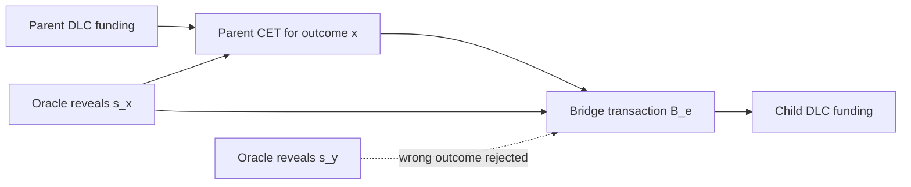

# NITI

[](https://github.com/dev865077/NITI/actions/workflows/v0-1-validation.yml)


NITI is a research and implementation workspace for composable Discreet Log
Contracts, or cDLCs. The core idea is narrow but powerful: a DLC oracle
attestation scalar revealed by a parent contract can also complete adaptor
signatures on a bridge transaction that funds the next contract.

The project is not production software. Do not use it with mainnet funds.

## Contents

- [What NITI Claims](#what-niti-claims)
- [How cDLC Composition Works](#how-cdlc-composition-works)
- [Current Evidence](#current-evidence)
- [Quick Start](#quick-start)
- [v0.1 Reproducibility](#v01-reproducibility)
- [Repository Map](#repository-map)
- [Formal Models](#formal-models)
- [Testnet Harness](#testnet-harness)
- [Financial Product Models](#financial-product-models)
- [Security Boundary](#security-boundary)
- [Roadmap](#roadmap)
- [License](#license)

## What NITI Claims

The conservative v0.1 claim is:

> Under the documented assumptions, NITI demonstrates a reproducible
> testnet/regtest-equivalent cDLC activation path: a parent outcome reveals an
> oracle scalar, that scalar completes the bridge adaptor signature, the bridge
> funds the child path, and a non-corresponding outcome does not activate that
> child path.

NITI does not claim mainnet readiness, safe custody, regulatory readiness,
production Lightning support, guaranteed solvency, or a complete financial
product stack.

The release scope is tracked in
[`docs/V0_1_ACCEPTANCE_MATRIX.md`](docs/V0_1_ACCEPTANCE_MATRIX.md). The remote
gate is [`v0.1 validation`](.github/workflows/v0-1-validation.yml).

## How cDLC Composition Works

A Schnorr oracle commits to a nonce point `R_o` and later attests an outcome
`x` by revealing:

```text
e_x = H(R_o || V || x)
s_x = r_o + e_x v mod n
S_x = s_xG = R_o + e_xV
```

Before the event, `S_x` is public but `s_x` is unknown. A cDLC uses `S_x` as
the adaptor point for a bridge transaction. When the oracle publishes `s_x`,
the bridge signature is completed:

```text
s = s_hat + s_x mod n
```

That bridge spends a parent outcome output and creates the funding output for a
child DLC. Bitcoin validates ordinary Taproot/Schnorr spends; the contract graph
and financial semantics remain off-chain.



## Current Evidence

| Evidence | Where | What it supports |
| --- | --- | --- |
| Primary whitepaper | [`WHITEPAPER.md`](WHITEPAPER.md) | cDLC construction, security claims, Lightning extension, limitations. |
| Protocol summary | [`docs/PROTOCOL.md`](docs/PROTOCOL.md) | Compact description of oracle, adaptor, bridge, Lightning, and graph discipline. |
| Architecture note | [`docs/ARCHITECTURE.md`](docs/ARCHITECTURE.md) | Research, proof, and testnet layers. |
| Layer 2 canonical scenario | [`docs/L2_SINGLE_CDLC_SCENARIO.md`](docs/L2_SINGLE_CDLC_SCENARIO.md) | Exact single-parent/single-child transaction graph, fixtures, timelocks, and pass/fail criteria for the v0.1 Layer 2 path. |
| Layer 2 parent funding harness | [`docs/L2_PARENT_FUNDING_HARNESS.md`](docs/L2_PARENT_FUNDING_HARNESS.md) | Deterministic signed Taproot funding transaction, txid/vout, raw tx, and consumption by the parent CET fixture. |
| Layer 2 parent CET harness | [`docs/L2_PARENT_CET_HARNESS.md`](docs/L2_PARENT_CET_HARNESS.md) | Serialized parent CET, stable txid, sighash inputs, edge output map, and bridge reference. |
| Layer 2 bridge harness | [`docs/L2_BRIDGE_HARNESS.md`](docs/L2_BRIDGE_HARNESS.md) | Serialized bridge transaction, stable txid, parent edge input, and child funding output. |
| Layer 2 bridge adaptor completion | [`docs/L2_BRIDGE_ADAPTOR_COMPLETION.md`](docs/L2_BRIDGE_ADAPTOR_COMPLETION.md) | Executable bridge signature evidence: pre-resolution failure, `s_x` completion, and `s_y` rejection. |
| Layer 2 parent CET confirmation | [`docs/L2_PARENT_CET_CONFIRMATION.md`](docs/L2_PARENT_CET_CONFIRMATION.md) | Deterministic regtest-equivalent confirmation transcript proving the parent CET is spendable by the bridge. |
| Layer 2 bridge confirmation | [`docs/L2_BRIDGE_CONFIRMATION.md`](docs/L2_BRIDGE_CONFIRMATION.md) | Deterministic regtest-equivalent confirmation transcript proving the bridge creates an unspent child funding outpoint. |
| Layer 2 child prepared spends | [`docs/L2_CHILD_PREPARED_SPENDS.md`](docs/L2_CHILD_PREPARED_SPENDS.md) | Prepared child CET and timelocked refund spends consuming the bridge-created child funding output. |
| Layer 2 edge refund timeout | [`docs/L2_EDGE_REFUND_TIMEOUT.md`](docs/L2_EDGE_REFUND_TIMEOUT.md) | Negative path proving the parent edge refund is rejected before timeout and accepted after maturity. |
| Layer 2 E2E transcript | [`docs/L2_E2E_TRANSCRIPT.md`](docs/L2_E2E_TRANSCRIPT.md) | Redacted audit transcript with replay commands and deterministic pass/fail checks. |
| Layer 2 deterministic closeout | [`docs/L2_EPIC_CLOSEOUT.md`](docs/L2_EPIC_CLOSEOUT.md) | Deterministic #56 evidence: child issue status, bounded Layer 2 claim, replay command, and residual risks. |
| Issue #132 regtest tx evidence | [`docs/evidence/issue-132-regtest/`](docs/evidence/issue-132-regtest/) | Bitcoin Core regtest RPC broadcast, mempool checks, confirmations, raw tx files, and signature-state distinctions. |
| SPARK-to-Bitcoin trace | [`docs/SPARK_TO_BITCOIN_TRACE.md`](docs/SPARK_TO_BITCOIN_TRACE.md) | Claim-by-claim mapping from formal algebra to transaction operations and smoke transcript fields. |
| SPARK/Ada models | [`spark/`](spark/) | Formal algebra and finite accounting models. |
| Testnet harness | [`testnet/`](testnet/) | TypeScript Taproot/adaptor, oracle, manifest, RPC, and Lightning hold-invoice tooling. |
| Public signet/testnet guide | [`testnet/PUBLIC_SIGNET.md`](testnet/PUBLIC_SIGNET.md) | Funding request and public-network activation workflow for #153 and #56. |
| Deterministic smoke test | `npm run test:cdlc-smoke` | Parent CET -> bridge -> child funding transcript, including wrong-outcome rejection. |
| CI gate | [GitHub Actions](https://github.com/dev865077/NITI/actions/workflows/v0-1-validation.yml) | Build, deterministic tests, Ada validator, and core SPARK proof regression. |
| Security notes | [`docs/SECURITY.md`](docs/SECURITY.md) | Operational boundaries and explicit non-goals. |

## Quick Start

Prerequisites:

- Node.js 20 or newer.
- `npm`.
- Optional: GNAT/GPRbuild for the Ada manifest validator.
- Optional: SPARK/GNATprove for formal proof runs.
- Optional: Bitcoin Core and LND for live testnet, signet, or regtest work.

Install dependencies and run the local deterministic harness:

```sh
npm ci
npm run build
npm test
```

Run the v0.1 cDLC smoke path directly:

```sh
npm run test:cdlc-smoke
```

Build and run the Ada manifest validator:

```sh
npm run ada:build
npm run testnet -- manifest:validate --file testnet/examples/sample-manifest.json
```

The full GitHub Actions gate is documented in
[`docs/V0_1_CI.md`](docs/V0_1_CI.md).

## v0.1 Reproducibility

The strict local entry point for the v0.1 claim is:

```sh
npm run v0.1:verify
```

It runs the deterministic TypeScript harness, the Ada manifest validator, the
core SPARK proof targets, and writes logs/transcripts under `testnet/artifacts/`.
The runner is documented in [`docs/V0_1_RUNNER.md`](docs/V0_1_RUNNER.md).

For controlled Bitcoin Core execution before public testnet/signet broadcast,
use the regtest guide:

```sh
scripts/regtest-env.sh start
scripts/regtest-env.sh env > .env
```

See [`testnet/REGTEST.md`](testnet/REGTEST.md).

## Repository Map

```text
.github/workflows/
  v0-1-validation.yml        Remote v0.1 validation gate
docs/
  evidence/issue-132-regtest/ Bitcoin Core regtest tx evidence bundle
  ARCHITECTURE.md            Research/proof/testnet architecture
  PROTOCOL.md                cDLC protocol summary
  ROADMAP.md                 Engineering roadmap
  SECURITY.md                Safety boundary and non-goals
  L2_SINGLE_CDLC_SCENARIO.md Canonical single-parent/single-child scenario
  L2_PARENT_FUNDING_HARNESS.md Parent funding transaction artifact
  L2_PARENT_CET_HARNESS.md   Parent CET edge-output artifact
  L2_BRIDGE_HARNESS.md       Bridge-to-child funding artifact
  L2_BRIDGE_ADAPTOR_COMPLETION.md Bridge signature completion artifact
  L2_PARENT_CET_CONFIRMATION.md Parent CET confirmation simulation
  L2_BRIDGE_CONFIRMATION.md  Bridge confirmation simulation
  L2_CHILD_PREPARED_SPENDS.md Child CET/refund prepared-spend artifact
  L2_EDGE_REFUND_TIMEOUT.md  Parent edge refund timeout artifact
  L2_E2E_TRANSCRIPT.md       Redacted Layer 2 audit transcript artifact
  L2_EPIC_CLOSEOUT.md        Layer 2 deterministic closeout and residual risk
  V0_1_ACCEPTANCE_MATRIX.md  Release claim and evidence matrix
  V0_1_CI.md                 CI gate documentation
  V0_1_RUNNER.md             One-command local v0.1 verification
research/
  cdlc-technical-note.md     Focused cDLC algebra note
  cdlc-algebra-check.ts      TypeScript algebra sanity check
  *-math.md                  Financial product math specifications
spark/
  src/                       SPARK/Ada proof models
  *.gpr                      GNATprove project files
  README.md                  Proof scope and commands
testnet/
  src/                       TypeScript harness and CLI
  ada/                       Ada cDLC manifest validator
  examples/                  Canonical manifests
  README.md                  Operational testnet flow
  LIGHTNING.md               Lightning hold-invoice harness
  PUBLIC_SIGNET.md           Public signet/testnet funding and activation guide
  REGTEST.md                 Deterministic Bitcoin Core regtest guide
WHITEPAPER.md                Primary cDLC whitepaper
LEGACY-WHITEPAPER.md         Historical NITI draft
```

The local `site/` directory is ignored by Git, so it is not part of the GitHub
evidence package.

## Formal Models

The proof layer contains SPARK/Ada models for the cDLC algebra, the Lightning
extension, and finite financial-product accounting models. The core proof
targets are:

| Target | Scope |
| --- | --- |
| `spark/cdlc_integer_proofs.gpr` | Symbolic integer identities using `SPARK.Big_Integers`. |
| `spark/cdlc_residue_proofs.gpr` | Explicit arithmetic over `Z/97Z`. |
| `spark/cdlc_proofs.gpr` | Ada built-in modular model over `type mod 97`. |
| `spark/lightning_cdlc_proofs.gpr` | HTLC/PTLC witness behavior, route tweaks, child activation, and channel-balance conservation in a finite model. |

The key cDLC properties modeled are:

- the oracle attestation scalar maps to the public attestation point;
- a bridge adaptor signature verifies before completion;
- adding the correct oracle scalar completes the bridge signature;
- a completed signature reveals the hidden scalar by subtraction;
- a different oracle scalar does not complete the same bridge signature.

The CI gate runs the four core targets above and rejects `pragma Assume` in the
proof sources. The broader product proof suite is documented in
[`spark/README.md`](spark/README.md).

Example core proof command:

```sh
gnatprove -P spark/cdlc_proofs.gpr \
  --level=4 \
  --prover=cvc5,z3,altergo \
  --timeout=20 \
  --report=all
```

## Testnet Harness

The TypeScript harness validates the Bitcoin-facing activation primitive:

```text
funded Taproot UTXO
  -> unsigned spend
  -> adaptor signature under S_x
  -> oracle publishes s_x
  -> completed Schnorr witness
  -> raw transaction ready for opt-in broadcast
```

Implemented today:

- BIP340-style oracle preparation and attestation.
- Taproot key-path adaptor spend generation.
- Signature completion from the oracle attestation scalar.
- Hidden-scalar extraction from a completed signature.
- Deterministic cDLC parent-CET -> bridge -> child-funding smoke transcript.
- Wrong-outcome negative checks.
- Bitcoin Core RPC scan and broadcast commands.
- Broadcast refusal unless `--allow-broadcast` is provided.
- LND hold-invoice artifacts for the HTLC-compatible Lightning extension.
- Live LND mutation refusal unless `--allow-live-lnd` is provided.
- Ada validation of finite cDLC graph manifests.

The operational guide is [`testnet/README.md`](testnet/README.md). The Lightning
hold-invoice guide is [`testnet/LIGHTNING.md`](testnet/LIGHTNING.md).

Generate and validate a sample manifest:

```sh
npm run testnet -- manifest:sample \
  --network testnet4 \
  --out testnet/examples/sample-manifest.json

npm run testnet -- manifest:validate \
  --file testnet/examples/sample-manifest.json
```

Run the offline Lightning mock:

```sh
npm run test:lightning
npm run testnet -- lightning:mock-run
```

## Financial Product Models

NITI also contains research specifications and SPARK models for financial
products that could be expressed as finite cDLC state transitions. These are
accounting and payoff models, not production products.

| Product family | Research spec | SPARK target |
| --- | --- | --- |
| BTC-backed loans and collateral lifecycle | [`research/btc-backed-loan-lifecycle-math.md`](research/btc-backed-loan-lifecycle-math.md) | `spark/btc_collateral_loan_proofs.gpr`, `spark/btc_loan_lifecycle_proofs.gpr` |
| Covered calls and yield notes | [`research/covered-call-yield-note-math.md`](research/covered-call-yield-note-math.md) | `spark/covered_call_yield_note_proofs.gpr` |
| Synthetic dollar and stable exposure | [`research/synthetic-dollar-stable-exposure-math.md`](research/synthetic-dollar-stable-exposure-math.md) | `spark/synthetic_dollar_stable_exposure_proofs.gpr` |
| Perpetuals and rolling forwards | [`research/perpetuals-rolling-forwards-math.md`](research/perpetuals-rolling-forwards-math.md) | `spark/perpetuals_rolling_forwards_proofs.gpr` |
| Collars, puts, protected notes | [`research/collars-protective-puts-principal-protected-notes-math.md`](research/collars-protective-puts-principal-protected-notes-math.md) | `spark/collars_protective_notes_proofs.gpr` |
| Barrier options | [`research/barrier-options-knock-continuations-math.md`](research/barrier-options-knock-continuations-math.md) | `spark/barrier_options_proofs.gpr` |
| Autocallables and callable notes | [`research/autocallables-callable-yield-notes-math.md`](research/autocallables-callable-yield-notes-math.md) | `spark/autocallables_proofs.gpr` |
| Accumulators and decumulators | [`research/accumulators-decumulators-math.md`](research/accumulators-decumulators-math.md) | `spark/accumulators_decumulators_proofs.gpr` |
| CPPI and portfolio insurance | [`research/cppi-portfolio-insurance-math.md`](research/cppi-portfolio-insurance-math.md) | `spark/cppi_proofs.gpr` |
| Variance and corridor swaps | [`research/volatility-variance-corridor-swaps-math.md`](research/volatility-variance-corridor-swaps-math.md) | `spark/variance_corridor_swaps_proofs.gpr` |
| Basis and calendar rolls | [`research/basis-calendar-term-structure-rolls-math.md`](research/basis-calendar-term-structure-rolls-math.md) | `spark/basis_calendar_rolls_proofs.gpr` |
| Parametric insurance and event-linked notes | [`research/parametric-insurance-event-linked-notes-math.md`](research/parametric-insurance-event-linked-notes-math.md) | `spark/parametric_insurance_proofs.gpr` |

The important boundary: these models prove internal accounting identities under
their stated assumptions. They do not prove market liquidity, fair pricing,
oracle quality, collateral availability, legal enforceability, or user safety.

## Security Boundary

Do not use this repository with mainnet funds.

The current code and proofs do not cover:

- production key storage;
- production wallet integration;
- full bilateral DLC negotiation;
- complete mainnet fee-bump, CPFP, anchor, or pinning policy;
- multi-oracle threshold attestations;
- production Lightning channel state machines;
- route liquidity, force-close, watchtower, and PTLC deployment behavior;
- oracle operational security and source integrity;
- economic solvency of any real financial product;
- legal or regulatory suitability.

Before publishing artifacts, check for local secrets:

```sh
find testnet/artifacts -maxdepth 1 -type f -not -name .gitkeep -print
test ! -f .env && echo ".env absent"
```

## Roadmap

The roadmap is maintained in [`docs/ROADMAP.md`](docs/ROADMAP.md). The current
sequence is:

1. Keep the algebra and deterministic harness reproducible.
2. Complete public testnet/signet evidence for a single cDLC path.
3. Add a bilateral protocol transcript with two independent participants.
4. Build an auditable oracle layer with announcement, nonce commitment,
   attestation verification, and history.
5. Add economic stress simulations for collateral, liquidation, timelocks, and
   recovery behavior.
6. Move only after review toward broader wallet, Lightning, oracle, and
   product integrations.

## License

ISC. See [`LICENSE`](LICENSE).
